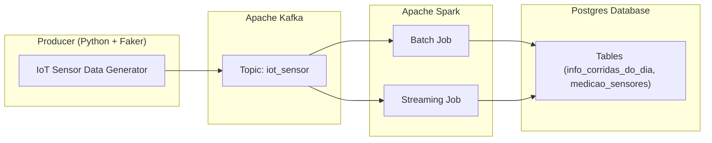
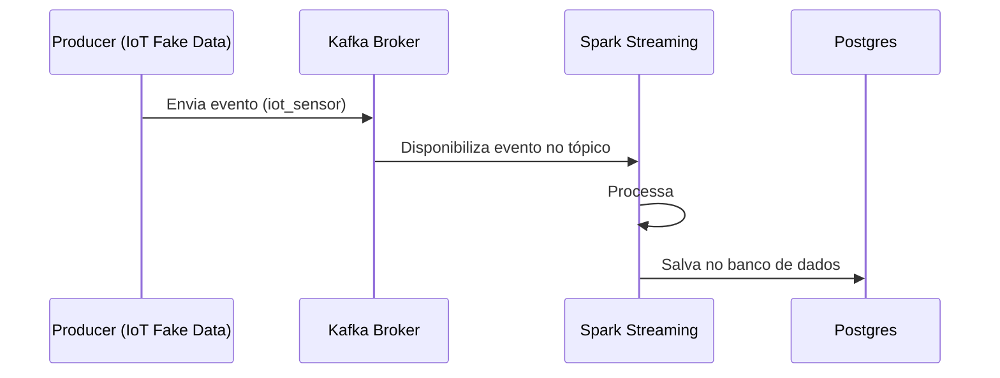

# 🚖📊 F1RST CodeElevate – Spark, Kafka e Postgres

Este repositório contém dois assignments que exploram pipelines de dados em um ambiente de **Big Data**, utilizando **Apache Spark**, **Apache Kafka** e **Postgres**.  
O objetivo é praticar **processamento batch e streaming**, organização de dados em camadas e construção de soluções resilientes e escaláveis.  

---

## ⚙️ Arquitetura da Solução

A arquitetura é composta por:

- **Producer (Kafka)** → gera eventos em tempo real (dados IoT falsos).
- **Kafka Broker** → atua como mensageria para transmitir eventos entre produtores e consumidores.
- **Spark** → consome dados em batch e streaming, processa e transforma.
- **Postgres** → armazena os resultados finais para análise posterior.

### 🔹 Diagrama Geral


---

## 📌 Assignment 1 – Diário de Bordo (Batch Processing)

Temos como entrada o dataset **`data/info_transportes.csv`**, com informações de corridas realizadas via aplicativo de transporte privado.  

**Colunas originais:**
- `DATA_INICIO` → formato `mm-dd-yyyy HH`
- `DATA_FIM`  
- `CATEGORIA` (Negócio, Pessoal, etc.)
- `LOCAL_INICIO`
- `LOCAL_FIM`
- `PROPOSITO` (Reunião, Lazer, etc.)
- `DISTANCIA`

### ✅ Objetivo
Gerar uma nova tabela: **`info_corridas_do_dia`**, agrupada por **data de início (yyyy-MM-dd)**.  
No processamento tratamos os campos DATA_INICIO, CATEGORIA e PROPOSITO (Padronizando a entrada para que não haja perda de informação/classificação no processamento)

**Colunas da tabela final:**
| Coluna | Descrição |
|--------|-----------|
| `DT_REFE` | Data de referência |
| `QT_CORR` | Quantidade de corridas |
| `QT_CORR_NEG` | Corridas categoria "Negócio" |
| `QT_CORR_PESS` | Corridas categoria "Pessoal" |
| `VL_MAX_DIST` | Maior distância |
| `VL_MIN_DIST` | Menor distância |
| `VL_AVG_DIST` | Distância média |
| `QT_CORR_REUNI` | Corridas com propósito "Reunião" |
| `QT_CORR_NAO_REUNI` | Corridas com propósito diferente de "Reunião" |

---

## 📌 Assignment 2 – Monitoramento de Sensores IoT (Streaming)

Aqui construímos um sistema que simula sensores IoT e processa os dados em **tempo real**.  

### ✅ Fluxo do sistema
1. **Producer** → gera dados falsos de sensores IoT (temperatura, umidade, localização, etc.) com a biblioteca `Faker`.  
2. **Kafka** → recebe os dados no tópico `iot_sensor`.  
3. **Consumer (Spark Streaming)** → consome os dados em tempo real e replica para o postgres a cada 20 segundos.  
4. **Postgres** → armazena os dados processados para consultas e dashboards.  

### 🔹 Diagrama do Streaming


---

## 🛠️ Como Rodar o Projeto

### 🔹 Pré-requisitos
- Docker e Docker Compose instalados
- Makefile disponível no ambiente (`make`)

### 🔹 Comandos principais
- **Criar os serviços**:
  ```bash
  make build
  ```
- **Subir os serviços**:
  ```bash
  make run
  ```
- **Criar topico**:
  ```bash
  make create-topic
  ```
- **Executar Spark-Streaming**:
  ```bash
  make stream-iot
  ```
- **Executar Spark-batch**:
  ```bash
  make batch
  ```
- **Rodar o Producer (O processo está configurado para gerar dados durante 5 minutos)**:
  ```bash
  make iot-sensor
  ```
- **Acessar Postgres**:
  ```bash
  make postgres
  ```
- **Rodar os testes unitarios das funções PySpark**:
  ```bash
  make unit-test
  ```
### 🔹 Consultar tabelas no Postgres
- **Tabela Streaming**:
  ```sql
  select * from medicao_sensores limit 10;
  select count(*) from medicao_sensores;
  ```
- **Tabela Batch**:
  ```sql
  sselect * from info_corridas_do_dia limit 10;
  select count(*) from info_corridas_do_dia;
  ```

---

## 📂 Estrutura do Repositório
```
F1RST-CODEELEVATE/
├─ docker-compose.yaml    # Orquestração de serviços (Spark, Kafka, Postgres, Producer e Pyspark-tests)
├─ Makefile               # Atalhos de execução
├─ data/                  # Dataset base (info_transportes.csv)
├─ producer/              # Código do Producer (Kafka + IoT fake data)
│   ├─ Dockerfile
│   └─ producer.py
├─ src/                   # Código principal
│   ├─ batch_job.py       # Pipeline batch (Assignment 1)
│   ├─ stream_iot_sensor.py # Pipeline streaming (Assignment 2)
│   ├─ functions.py       # Funções auxiliares
│   └─ tests/             # Testes PySpark
│       └─ test_funtions.py

```

---

## 🎯 Conclusão

Este projeto cobre **duas frentes fundamentais em Big Data**:
- **Processamento Batch (Spark + CSV → Postgres)**  
- **Processamento Streaming (Kafka + IoT → Spark → Postgres)**  

A arquitetura foi projetada para ser:
- Escalável  
- Resiliente a falhas  
- Focada em qualidade e integridade dos dados  

---

## ⚠️ Alerta

Em um cenário real, o ideal no processamento em batch é ingerir os dados de preferência no formato parquet do DataLake(camanda bronze), fazer os tratamentos até a camanda gold (Aqui representado pelo Postgres).